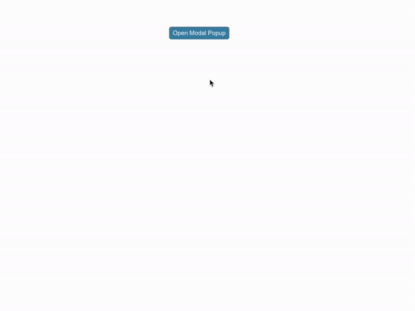

# Popup-Modal-Project

Passing Props from Parent Component modalP to child PopupModal
import { useState } from "react";
import PopupModal from "./modal";
import "./styles.css";
export default function ModalP() {
  const [showModalPopup, setShowModalPopup] = useState(false);

  function handleToggleModalPopup() {
    setShowModalPopup(!showModalPopup);
  }
  function onClose() {
    setShowModalPopup(false);
  }
  return (
    

      <button onClick={handleToggleModalPopup}>Open Modal Popup</button>
      {showModalPopup && (
        <PopupModal onClose={onClose} body={<h3>Custom Body</h3>} />
      )}
    

  );
}
----------
import React from "react";
import "./styles.css";

export default function PopupModal({ id, header, body, footer, onClose }) {
  return (
    

      

        

          &times;
          <h3>{header ? header : "Header"}</h3>
        

        

          {body ? (
            body
          ) : (
            

              
This is Modal Body...

            

          )}
        

        
{footer ? footer : <h3>Footer</h3>}

      

    

  );
}
